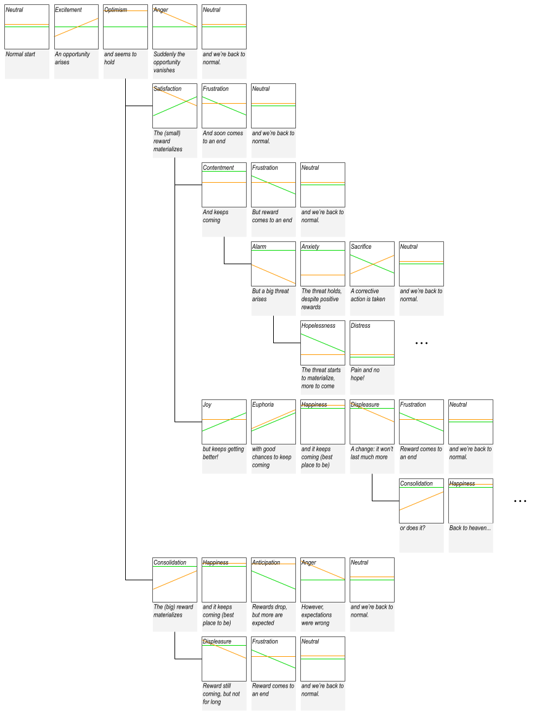

# Extra content

* Theoretical validation of LOVE profile terms.
* Videos used during for the emotional attribution survey.

## Theoretical validation of LOVE profile terms

These are the final emotion terms associated to the thirty LOVE 2:5x6 LOVE reference profiles (idealized patterns of the latest observed values):

The thirty terms were theoretically validated and refined (before the experimental validations) over the following 38 simulated emotional sequences (the methodology followed is described in the original paper).

### Series 1.1 and 1.2
Variations starting with an opportunity. Start: Neutral -> Excitement -> Optimism -> ...

Coverage:
- 18 fully coherent paths
- 63 emotional states

#### Series 1.1

#### Series 1.2

### Series 2
Variations starting with a threat. Start: Neutral -> Fear -> ...

Coverage:
- 11 fully coherent paths
- 34 emotional states

#### Series 2.1

### Series 3
Focus studies.

Coverage:
- 9 fully coherent paths
- 34 emotional states

#### Series 3.1
Study of the symmetry between anticipated, quick positive/negative rewards.

#### Series 3.2
Evolution of a supposedly-temporary negative reward.

#### Series 3.3
Paths including “Contentment”.

## Videos used during for the emotional attribution survey

The 48 videos rated during the survey can be found in the folder [./data/original/survey/videos](./../data/original/survey/videos/). These are examples of videos where each of the learned emotions prevailed.

* Learned emotion 0 (attributed to "Distress") [sequence_cluster_0_s10_ep1_196_296.mp4](./../data/original/survey/videos/sequence_cluster_0_s10_ep1_196_296.mp4).
* Learned emotion 1 (attributed to "Optimism") [sequence_cluster_1_s0_ep4_259_339.mp4](./../data/original/survey/videos/sequence_cluster_1_s0_ep4_259_339.mp4).
* Learned emotion 2 (attributed to "Neutral / slight Concern") [sequence_cluster_2_s0_ep5_101_156.mp4](./../data/original/survey/videos/sequence_cluster_2_s0_ep5_101_156.mp4).
* Learned emotion 3 (attributed to "Satisfaction") [sequence_cluster_3_s0_ep2_173_233.mp4](./../data/original/survey/videos/sequence_cluster_3_s0_ep2_173_233.mp4).
* Learned emotion 4 (attributed to "high Optimism") [sequence_cluster_4_s0_ep0_67_121.mp4](./../data/original/survey/videos/sequence_cluster_4_s0_ep0_67_121.mp4).
* Learned emotion 5 (attributed to "Concern") [sequence_cluster_5_s0_ep1_194_278.mp4](./../data/original/survey/videos/sequence_cluster_5_s0_ep1_194_278.mp4).
* Learned emotion 6 (attributed to "Excitement") [sequence_cluster_6_s0_ep5_0_52.mp4](./../data/original/survey/videos/sequence_cluster_6_s0_ep5_0_52.mp4).
* Learned emotion 7 (attributed to "Fear") [sequence_cluster_7_s30_ep4_218_279.mp4](./../data/original/survey/videos/sequence_cluster_7_s30_ep4_218_279.mp4).

